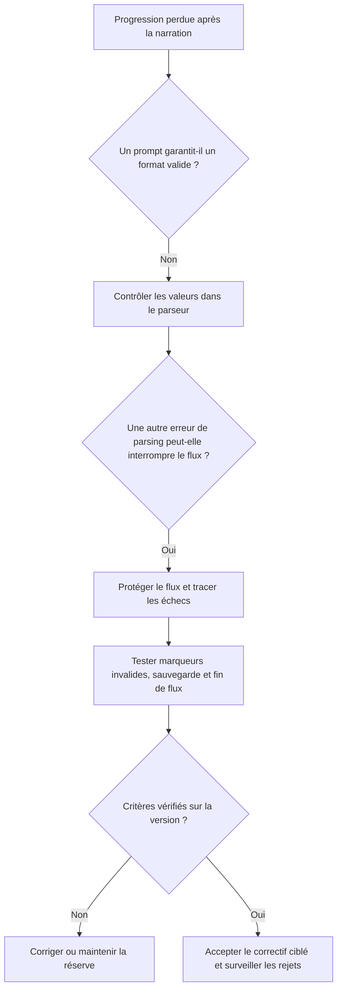

# C3.2.2 — Arbitrage : protéger la progression face à une narration invalide

**Date de rédaction :** 20 septembre 2026.  
**Cas historique :** ANO-2026-001, correction du 19 août 2026, commit `4ec094c`.  
**Statut :** analyse rétrospective étayée par les sources et l'historique Git ; pas compte rendu d'une réunion client.

## 1. Problématique et conséquences

Une narration pouvait contenir un marqueur tel que « rations=aucune » alors que le moteur attendait une valeur numérique. La conversion échouait après l'envoi du texte, mais avant la sauvegarde et la fin du flux. Pour le joueur : attente prolongée, puis progression perdue après rechargement. Le [dossier d'anomalie](../bloc4/03_collecte_consignation_anomalies.md) décrit la reproduction et les observations avant/après.

Le problème oblige à arbitrer entre une amélioration du texte fourni au narrateur et une correction de l'application. Une simple consigne à l'IA semble moins intrusive mais laisse subsister un risque de perte de données. La valeur prioritaire à protéger est la progression du joueur, pas la qualité stylistique de la scène.

## 2. Options et aide à la décision

Critères retenus pour cette analyse : éliminer la cause identifiée, protéger la sauvegarde, rendre le défaut observable et limiter la surface de changement. Les appréciations sont qualitatives : aucun devis comparatif historique ni chronométrage des options n'a été retrouvé.

| Option | Gain attendu | Limite / risque | Décision constatée |
|---|---|---|---|
| A — renforcer seulement le prompt | Réduire la fréquence des marqueurs incorrects. | Une sortie générée reste variable ; aucune garantie d'absence d'erreur. | Insuffisant seul ; non retenu comme correction principale. |
| B — contrôler la conversion dans le parseur | Traiter la cause identifiée et ignorer uniquement la valeur inexploitable. | La ressource concernée ne sera pas modifiée ; décalage possible avec le récit. | Retenu. |
| C — protéger aussi le traitement dans le flux SSE | Permettre au flux de poursuivre vers la sauvegarde malgré une erreur de parsing. | Ne corrige pas seul la cause ; une interception silencieuse masquerait les incidents. | Retenu en complément, avec journalisation et métriques. |

### Logigramme de décision reconstitué

Ce logigramme formalise aujourd'hui la logique du choix ; il n'est pas présenté comme un outil utilisé pendant une réunion d'août.

## 3. Décision et réalisation vérifiable

Le choix mis en œuvre combine **B + C**, avec traçabilité des marqueurs rejetés. L'historique Git consulté le 20 septembre montre, dans `4ec094c`, les modifications de [src/state.py](../../src/state.py), [backend/api.py](../../backend/api.py) et l'ajout de [tests/test_state_markers.py](../../tests/test_state_markers.py), ainsi que les formulaires de signalement.

Le document d'anomalie décrit des tests de non-régression, un événement de fin de flux et une sauvegarde atteinte après correction. Ces résultats sont **historiques et rapportés par cette pièce**, non réexécutés lors de la rédaction du Bloc 3. La présence du correctif dans Git ne prouve pas son déploiement sur le VPS ni l'absence de toute autre perte de données.

Le rejet d'une valeur ne doit pas être présenté comme une mise à jour métier réussie. Le récit peut annoncer un changement non appliqué : c'est un risque résiduel à surveiller, pas une raison pour réintroduire une conversion non contrôlée.

## 4. Dimension de pilotage : impacts et limites

| Dimension | Analyse étayée ou limite |
|---|---|
| Qualité / priorité | Le défaut compromet un parcours essentiel, la conservation de la progression. Sa correction est prioritaire sur l'enrichissement narratif. Cette priorité est argumentée ici, sans inventer l'ordre historique du backlog. |
| Périmètre | Correction ciblée du parseur et du flux, tests et observabilité ; pas de changement de fournisseur IA ni de refonte du moteur. |
| Coût / charge | Aucun relevé d'heures disponible pour ce correctif. Ne pas convertir les lignes modifiées ou la date du commit en jours-homme. |
| Délais | Aucun retard réel ni fonctionnalité reportée n'est établi par les sources. L'impact précis reste non mesuré. |
| Décideur | Réalisation dans le projet individuel. Aucun comité, vote ou accord client associé n'a été retrouvé. |
| Validation | Tests historiques consignés ; recette de la dernière version et acceptation client distinctes. |

Pour une décision similaire dans la phase future, je consignerai l'effort prévu, la tâche interrompue, le reste à faire et la nouvelle date dans le [tableau de bord](02_TABLEAU_DE_BORD.md), puis demanderai un accord si la réserve, le périmètre ou l'échéance sont dépassés.

## 5. Analyse critique et message client

La décision évite de faire reposer l'intégrité d'une partie sur la seule obéissance d'un modèle génératif. La combinaison d'un contrôle local et d'une protection du flux limite les conséquences d'une erreur. En revanche, elle nécessite des messages et mesures utiles : multiplier les interceptions sans observabilité rendrait la qualité difficile à suivre.

Ce qui manque rétrospectivement est la trace de pilotage autour du correctif : effort, arbitrage de priorité et communication. Je ne peux pas la remplacer par un compte rendu inventé ; je peux expliquer le choix technique observé et améliorer le processus de décision pour la suite.

**Formulation client :** « Un récit pouvait contenir une donnée que le jeu ne savait pas interpréter. Nous avons choisi de protéger la sauvegarde plutôt que de compter uniquement sur une consigne à l'IA. Une donnée invalide est maintenant écartée et signalée. Le correctif traite ce cas précis ; la reprise complète de partie doit aussi être vérifiée sur la version livrée. »

## 6. Couverture C3.2.2

La problématique, ses conséquences, les options et la décision argumentée sont présentées. Le correctif dispose d'une référence Git contrôlée. L'utilisation historique d'un logigramme, les heures consommées et une validation client ne sont pas revendiquées : la qualification finale du livrable appartient au jury.