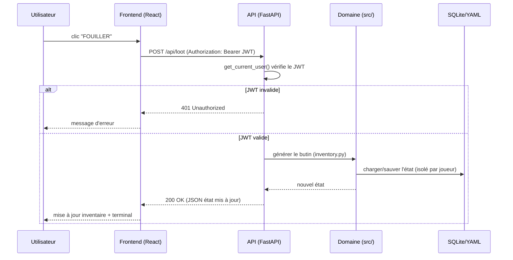

# Documentation technique

**Projet :** RPG 40K Survivor
**Stack :** React (Vite) · FastAPI · SQLite · OpenAI

---

## 1. Architecture logicielle

Trois couches clairement séparées :

1. **Présentation** — SPA React (`frontend/`).
2. **API / logique applicative** — FastAPI (`backend/`).
3. **Domaine métier du jeu** — modules Python (`src/`).

```
frontend (React/Vite)
   │  REST (actions) + SSE (narration)
   ▼
backend/api.py (FastAPI)
   ├─ backend/auth.py       → JWT + bcrypt + rôles
   ├─ backend/database.py   → SQLite (comptes, événements)
   └─ src/*.py              → état, combat, inventaire, monde, quêtes, IA
   │
   ▼
OpenAI API (narration) + SQLite + sauvegardes YAML
```

## 2. Stack et versions

| Composant | Version | Rôle |
|---|---|---|
| Python | 3.13 | Runtime backend |
| FastAPI | ≥ 0.136 | Framework API REST + SSE |
| PyJWT | ≥ 2.9 | Génération / vérification JWT |
| bcrypt | ≥ 4.2 | Hachage des mots de passe |
| React | 18 | Interface |
| Vite | 8 | Build / dev server |
| SQLite | intégré | Persistance relationnelle |

## 3. Flux de données (exemple : action de jeu)

```
1. L'utilisateur clique "FOUILLER" dans le frontend.
2. api.js envoie POST /api/loot avec l'en-tête Authorization: Bearer <JWT>.
3. FastAPI valide le JWT (dépendance get_current_user) → identité + rôle.
4. La session du joueur est chargée/instanciée (isolée par utilisateur).
5. Le domaine (src/inventory.py) génère du butin.
6. L'état est sauvegardé (YAML) et renvoyé en JSON.
7. Le frontend met à jour l'inventaire et le terminal.
```

Pour la **narration** (`/api/start`, `/api/chat`), la réponse est un flux **SSE** :
le backend streame les tokens de l'IA au fur et à mesure (`_gm_stream`).

## 4. Sécurité

| Mesure | Implémentation |
|---|---|
| Mots de passe hachés | bcrypt (`backend/auth.py: hash_password`) |
| Jetons signés | JWT HS256 avec expiration (`create_access_token`) |
| Vérification à chaque requête | dépendance `get_current_user` |
| Rôles | `player` / `admin`, `require_admin` sur routes sensibles |
| Secrets hors dépôt | `JWT_SECRET`, `OPENAI_API_KEY` en variables d'environnement |
| 401 / 403 | accès refusé sans jeton / sans rôle suffisant |

## 5. Points d'API principaux

| Méthode | Route | Auth | Description |
|---|---|---|---|
| GET | `/api/health` | non | État de santé |
| POST | `/api/auth/register` | non | Créer un compte (retourne JWT) |
| POST | `/api/auth/login` | non | Se connecter (retourne JWT) |
| GET | `/api/auth/me` | JWT | Identité courante |
| GET | `/api/users` | admin | Liste des utilisateurs |
| GET | `/api/state` | JWT | État complet de la partie |
| POST | `/api/start` | JWT | Démarrer (SSE) |
| POST | `/api/chat` | JWT | Message au MJ (SSE) |
| POST | `/api/roll` | JWT | Jet 2D6 |
| POST | `/api/combat/start` | JWT | Démarrer un combat |
| POST | `/api/combat/action` | JWT | Action de combat |
| POST | `/api/travel` | JWT | Déplacement |
| POST | `/api/loot` | JWT | Butin |
| POST | `/api/learn` | JWT | Compétence |
| POST | `/api/save` | JWT | Sauvegarde |
| POST | `/api/reset` | JWT | Nouvelle partie |

La documentation interactive OpenAPI est disponible sur `/docs` (Swagger UI généré par FastAPI).

## 6. Installation et lancement

### Backend

```powershell
python -m venv .venv
.\.venv\Scripts\Activate.ps1
pip install -r requirements.txt
uvicorn backend.api:app --reload --port 8000
```

### Frontend

```powershell
cd frontend
npm install
npm run dev
```

### Variables d'environnement (`.env`)

```env
OPENAI_API_KEY=sk-...        # optionnel (repli local sinon)
JWT_SECRET=une-chaine-secrète
JWT_EXPIRE_MINUTES=720
```

### Créer un administrateur (pour tester les rôles)

```powershell
python -m backend.create_admin monadmin motdepasse
```

## 7. Tests

```powershell
pytest            # tests backend (dont auth JWT)
cd frontend
npm test          # tests unitaires frontend
```

## 8. Arborescence du projet

```
rpg 40k/
├── backend/
│   ├── api.py            # routes FastAPI (REST + SSE)
│   ├── auth.py           # JWT, bcrypt, rôles, dépendances de sécurité
│   ├── database.py       # SQLite : schéma, migration, accès comptes
│   └── create_admin.py   # utilitaire de promotion admin
├── src/                  # domaine métier (indépendant du web)
│   ├── state.py          # état de partie
│   ├── combat.py         # combat au tour par tour
│   ├── inventory.py      # inventaire, butin procédural
│   ├── world.py          # zones, déplacements
│   ├── quests.py         # quêtes
│   ├── relationships.py  # relations de faction
│   ├── progression.py    # XP, compétences
│   ├── entities.py       # personnages, ennemis
│   ├── dice.py           # jets de dés
│   ├── prompt_builder.py # construction du prompt IA
│   └── persistence.py    # sauvegarde/chargement YAML
├── frontend/
│   └── src/
│       ├── App.jsx           # composant racine + gating auth
│       ├── api.js            # client HTTP, tokens, SSE
│       ├── hooks/            # hooks (useSSEChat...)
│       └── components/       # panneaux UI (Terminal, Combat, Inventory...)
├── tests/                # tests backend (pytest)
├── docs/module/          # livrables du module (ce dossier)
└── requirements.txt
```

## 9. Diagramme de séquence — action de jeu authentifiée



## 10. Gestion des erreurs (codes HTTP)

| Code | Signification | Cas déclencheur |
|---|---|---|
| 200 | Succès | Action traitée, état renvoyé |
| 201 | Créé | Inscription réussie (`/api/auth/register`) |
| 400 | Requête invalide | Paramètres manquants / malformés |
| 401 | Non authentifié | JWT absent, expiré ou invalide |
| 403 | Interdit | Rôle insuffisant (ex. `/api/users` sans admin) |
| 409 | Conflit | Login déjà utilisé à l'inscription |
| 422 | Validation | Corps de requête non conforme au schéma Pydantic |
| 500 | Erreur serveur | Exception non gérée (repli IA local si OpenAI échoue) |

La validation Pydantic génère automatiquement les réponses `422` documentées dans Swagger.

## 11. Exemples requête / réponse

### Inscription

```http
POST /api/auth/register
Content-Type: application/json

{ "user_id": "karimus", "display_name": "Karimus", "password": "secret42" }
```

```json
HTTP/1.1 201 Created
{
  "access_token": "eyJhbGciOiJIUzI1NiIsInR5cCI6IkpXVCJ9...",
  "token_type": "bearer",
  "user": { "id": "karimus", "display_name": "Karimus", "role": "player" }
}
```

### Appel d'une route protégée sans jeton

```http
GET /api/state
```

```json
HTTP/1.1 401 Unauthorized
{ "detail": "Not authenticated" }
```

## 12. Déploiement (Docker Compose)

Le projet est conteneurisé et déployé sur un VPS via Docker Compose.

```powershell
# Sur le serveur
docker compose -p rpg40k up -d --build
docker compose -p rpg40k ps
docker compose -p rpg40k logs -f
```

Variables clés côté serveur (`.env`) :

```env
RPG40K_BIND_ADDRESS=0.0.0.0
RPG40K_HTTP_PORT=8081
JWT_SECRET=<secret fort généré via /dev/urandom>
OPENAI_API_KEY=<clé liée à un compte actif>
```

Application en production : `http://89.116.111.166:8081/` — voir aussi
[docs/deploiement_vps.md](../deploiement_vps.md).

## 13. Observabilité et supervision

| Élément | Moyen |
|---|---|
| Santé du service | `GET /api/health` → `200 OK` |
| Healthcheck conteneur | Défini dans `docker-compose` (surveille `/api/health`) |
| Logs applicatifs | `docker compose -p rpg40k logs -f` |
| Traçabilité métier | Table `session_events` (register/login) |
| Documentation vivante | Swagger UI auto-généré sur `/docs` |

## 14. Conventions de code

- **Backend** : découpage couche API (`backend/`) vs domaine métier (`src/`) ;
  les modules `src/` ne dépendent pas de FastAPI (testables isolément).
- **Frontend** : un composant par panneau UI, logique réseau centralisée dans
  `api.js`, flux temps réel isolé dans un hook (`useSSEChat`).
- **Sécurité** : aucun secret dans le dépôt ; validation systématique du JWT via
  dépendance FastAPI ; mots de passe uniquement hachés.
