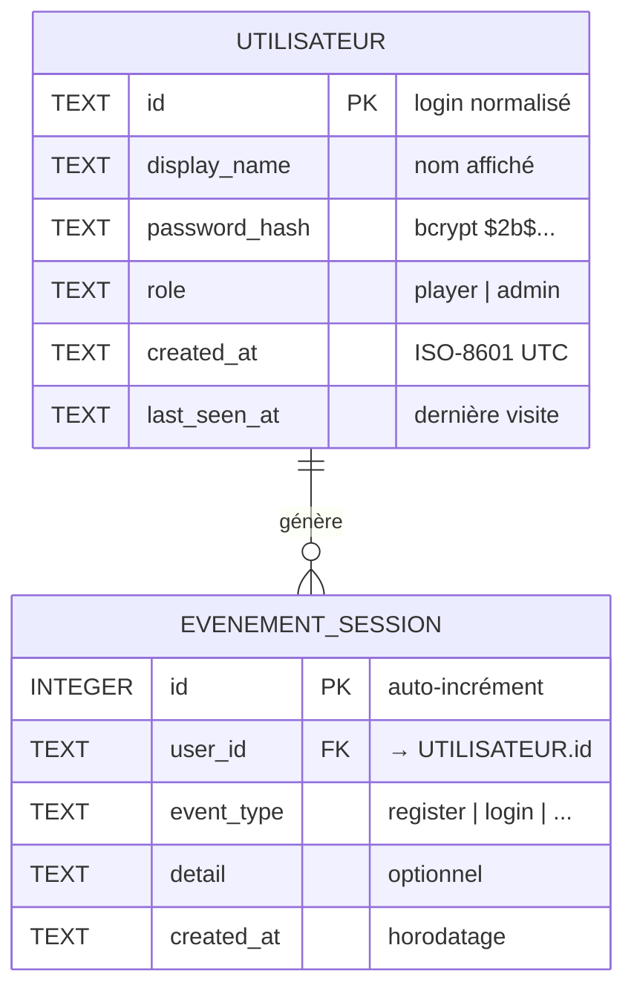

# MCD / MLD — Modèle de données

**Projet :** RPG 40K Survivor
**SGBD :** SQLite (`data/rpg40k.sqlite3`)

Ce document décrit le modèle conceptuel (MCD) et le modèle logique (MLD) des données
persistées en base relationnelle. Les données de partie détaillées (inventaire, carte,
quêtes) sont sérialisées en fichiers YAML par utilisateur ; la base relationnelle gère
les **comptes**, les **rôles** et les **traces de session**.

---

## 1. Modèle Conceptuel de Données (MCD)

Entités et relation principale :

```
┌────────────────────────┐               ┌────────────────────────┐
│        UTILISATEUR      │               │     EVENEMENT_SESSION   │
├────────────────────────┤   1      0,n   ├────────────────────────┤
│ # id                   │───────────────<│ # id                   │
│   nom_affiche          │  génère        │   type_evenement       │
│   mot_de_passe_hache   │                │   detail               │
│   role                 │                │   date_creation        │
│   date_creation        │                │                        │
│   date_derniere_visite │                │                        │
└────────────────────────┘               └────────────────────────┘
```

**Règles de gestion :**
- Un **utilisateur** possède un identifiant unique (login normalisé).
- Un utilisateur a exactement **un rôle** (`player` ou `admin`).
- Un utilisateur peut générer **zéro ou plusieurs événements** de session.
- Un événement de session appartient à **un seul** utilisateur.
- Le mot de passe n'est jamais stocké en clair : seul son **hash bcrypt** est conservé.

## 2. Modèle Logique de Données (MLD)

Notation relationnelle (clé primaire soulignée `#`, clé étrangère `→`) :

```
UTILISATEUR (#id, nom_affiche, mot_de_passe_hache, role, date_creation, date_derniere_visite)

EVENEMENT_SESSION (#id, user_id → UTILISATEUR.id, type_evenement, detail, date_creation)
```

## 3. Schéma physique SQLite (DDL réel)

```sql
CREATE TABLE users (
    id            TEXT PRIMARY KEY,          -- login normalisé (unique)
    display_name  TEXT NOT NULL,             -- nom affiché
    password_hash TEXT,                      -- hash bcrypt ($2b$...)
    role          TEXT NOT NULL DEFAULT 'player', -- 'player' | 'admin'
    created_at    TEXT NOT NULL,             -- horodatage ISO-8601 UTC
    last_seen_at  TEXT NOT NULL
);

CREATE TABLE session_events (
    id          INTEGER PRIMARY KEY AUTOINCREMENT,
    user_id     TEXT NOT NULL,
    event_type  TEXT NOT NULL,               -- 'register' | 'login' | ...
    detail      TEXT,
    created_at  TEXT NOT NULL,
    FOREIGN KEY (user_id) REFERENCES users(id)
);
```

## 4. Dictionnaire de données

### Table `users`

| Colonne | Type | Contrainte | Description |
|---|---|---|---|
| id | TEXT | PK | Identifiant de connexion normalisé |
| display_name | TEXT | NOT NULL | Nom affiché dans l'interface |
| password_hash | TEXT | — | Hash bcrypt du mot de passe |
| role | TEXT | NOT NULL, défaut `player` | Rôle applicatif |
| created_at | TEXT | NOT NULL | Date de création (UTC ISO-8601) |
| last_seen_at | TEXT | NOT NULL | Dernière connexion |

### Table `session_events`

| Colonne | Type | Contrainte | Description |
|---|---|---|---|
| id | INTEGER | PK, auto-incrément | Identifiant technique |
| user_id | TEXT | FK → users.id | Utilisateur concerné |
| event_type | TEXT | NOT NULL | Type d'événement |
| detail | TEXT | — | Détail optionnel |
| created_at | TEXT | NOT NULL | Horodatage de l'événement |

## 5. Normalisation

Le modèle respecte la **3e forme normale (3FN)** :
- **1FN** : chaque attribut est atomique (pas de liste dans une colonne).
- **2FN** : toutes les colonnes dépendent de la clé primaire complète.
- **3FN** : aucune dépendance transitive (le rôle et le hash dépendent
  directement de l'utilisateur, pas d'un autre attribut non-clé).

## 6. Fidélité MLD / implémentation

Le MLD est fidèlement traduit dans le code :
- création et migration du schéma : [backend/database.py](../../backend/database.py) (`init_db`) ;
- accès aux comptes : `create_account`, `get_account`, `list_users` ;
- traces de session : `record_event`.

## 7. Diagramme entité-association (Mermaid)



## 8. Contraintes d'intégrité

| Contrainte | Table | Règle appliquée |
|---|---|---|
| Clé primaire | `users` | `id` unique (login normalisé en minuscules) |
| Clé primaire | `session_events` | `id` auto-incrément |
| Clé étrangère | `session_events.user_id` | Référence `users.id` |
| Domaine | `users.role` | Valeurs applicatives `player` / `admin` |
| Non nul | `display_name`, `role`, `created_at`, `last_seen_at` | Champs obligatoires |
| Sécurité | `password_hash` | Jamais en clair, toujours haché bcrypt |

## 9. Index et performance

| Index | Colonne(s) | Objectif |
|---|---|---|
| PK implicite | `users.id` | Recherche O(log n) au login (route la plus sollicitée) |
| PK implicite | `session_events.id` | Unicité technique |
| Recommandé | `session_events(user_id, created_at)` | Accélère l'historique par utilisateur trié par date |

> Le SGBD étant SQLite avec une volumétrie faible (usage démo/pédagogique), les
> index sur clés primaires suffisent. L'index composite `(user_id, created_at)`
> est une évolution recommandée si la table d'événements grossit.

## 10. Requêtes SQL types

```sql
-- Inscription : création d'un compte joueur (hash calculé côté application)
INSERT INTO users (id, display_name, password_hash, role, created_at, last_seen_at)
VALUES (?, ?, ?, 'player', ?, ?);

-- Connexion : récupération du compte pour vérifier le mot de passe
SELECT id, display_name, password_hash, role
FROM users
WHERE id = ?;

-- Mise à jour de la dernière visite après authentification réussie
UPDATE users SET last_seen_at = ? WHERE id = ?;

-- Traçabilité : journalisation d'un événement de session
INSERT INTO session_events (user_id, event_type, detail, created_at)
VALUES (?, ?, ?, ?);

-- Administration : liste des utilisateurs (route protégée `require_admin`)
SELECT id, display_name, role, created_at, last_seen_at
FROM users
ORDER BY created_at DESC;

-- Historique d'activité d'un joueur
SELECT event_type, detail, created_at
FROM session_events
WHERE user_id = ?
ORDER BY created_at DESC
LIMIT 50;
```

## 11. Séparation base relationnelle / sauvegardes de partie

Le modèle applique une séparation assumée des responsabilités :

| Donnée | Support | Justification |
|---|---|---|
| Comptes, rôles, authentification | **SQLite (relationnel)** | Intégrité, requêtes, sécurité |
| Traces de session | **SQLite (relationnel)** | Audit, historique |
| État de partie détaillé (inventaire, carte, quêtes) | **YAML par joueur** | Structure imbriquée riche, lisible, isolée |

Cette séparation est **documentée comme dette technique** dans l'analyse critique :
la migration des sauvegardes de partie vers des tables SQL dédiées est identifiée
comme évolution post-module.

## 12. Évolution possible du schéma (post-module)

```sql
-- Table envisagée pour persister l'état de partie en relationnel
CREATE TABLE game_saves (
    id          INTEGER PRIMARY KEY AUTOINCREMENT,
    user_id     TEXT NOT NULL,
    slot        INTEGER NOT NULL DEFAULT 1,
    state_json  TEXT NOT NULL,            -- snapshot sérialisé de l'état
    updated_at  TEXT NOT NULL,
    UNIQUE (user_id, slot),
    FOREIGN KEY (user_id) REFERENCES users(id)
);
```

Cette table remplacerait à terme les fichiers YAML, tout en conservant la même
logique d'isolation par utilisateur.
