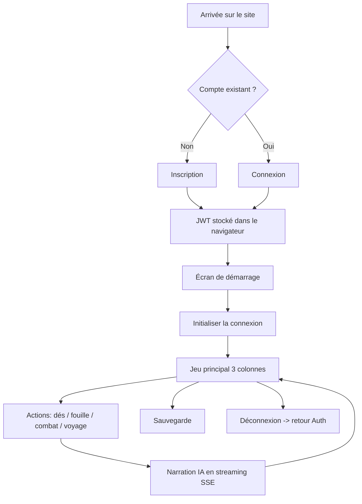

# Wireframes — Écrans clés

**Projet :** RPG 40K Survivor — frontend React

Ces wireframes décrivent les écrans principaux et les flux d'interaction.
Le style visuel est un **terminal grimdark** (vert phosphore sur fond noir, scanlines).

---

## Écran 1 — Authentification (connexion / inscription)

```
┌───────────────────────────────────────────────────────────┐
│  ⚙ HIVE-NODE//SECTEUR-7                 ○ SYSTÈME OK        │
├───────────────────────────────────────────────────────────┤
│                                                           │
│                 AUTHENTIFICATION VOX                       │
│                                                           │
│           IDENTIFIANT                                      │
│           [_______________________]                       │
│                                                           │
│           MOT DE PASSE                                     │
│           [_______________________]                       │
│                                                           │
│               [ SE CONNECTER ]                            │
│                                                           │
│        Pas encore d'accès ? Créer un compte               │
│                                                           │
└───────────────────────────────────────────────────────────┘
```
Composant : [AuthPanel.jsx](../../frontend/src/components/AuthPanel.jsx)
Bascule entre **connexion** et **inscription** (champ « nom affiché » en plus).

## Écran 2 — Démarrage de partie

```
┌───────────────────────────────────────────────────────────┐
│  ⚙ HIVE-NODE//SECTEUR-7        ○ SYSTÈME OK   ⏻ DÉCONNEXION│
├───────────────────────────────────────────────────────────┤
│                 ███ SURVIVANT ███                          │
│         RUCHES DE KHARAD-RHO · INVASION TYRANIDE           │
│                                                           │
│         Opérateur authentifié : KARIMUS                    │
│                                                           │
│              [ INITIALISER LA CONNEXION ]                  │
└───────────────────────────────────────────────────────────┘
```

## Écran 3 — Jeu principal (layout 3 colonnes)

```
┌───────────────────────────────────────────────────────────┐
│  ⚙ HIVE-NODE//SECTEUR-7   ● TRANSMISSION VOX  ⏻ DÉCONNEXION│
├───────────┬───────────────────────────────┬───────────────┤
│ PERSONNAGE│      TERMINAL NARRATIF         │    COMBAT     │
│  - PV     │  > Karimus reprend conscience  │  [ATTAQUER]   │
│  - Stress │    dans la coursive...         │  [DÉFENDRE]   │
│           │  (streaming IA en direct)      │  [FUIR]       │
│  CARTE    │                                │               │
│  - Zone   │                                │  INVENTAIRE   │
│  - Sorties│                                │  - Couteau    │
│           ├───────────────────────────────┤  - Casque     │
│  QUÊTES   │ [DÉS] [FOUILLER] [RENCONTRE]   │               │
│  - ...    │ [VOYAGER] [SAUVER] [RESET]     │               │
│           ├───────────────────────────────┤               │
│           │ > _saisir une action_______    │               │
└───────────┴───────────────────────────────┴───────────────┘
```

**Zones fonctionnelles :**
- **Colonne gauche** : personnage, carte, quêtes ([CharacterPanel](../../frontend/src/components/CharacterPanel.jsx), [MapPanel](../../frontend/src/components/MapPanel.jsx), [QuestPanel](../../frontend/src/components/QuestPanel.jsx)).
- **Colonne centrale** : terminal narratif (streaming IA), panneau d'actions, barre de saisie ([Terminal](../../frontend/src/components/Terminal.jsx), [ActionPanel](../../frontend/src/components/ActionPanel.jsx), [InputBar](../../frontend/src/components/InputBar.jsx)).
- **Colonne droite** : combat et inventaire ([CombatPanel](../../frontend/src/components/CombatPanel.jsx), [InventoryPanel](../../frontend/src/components/InventoryPanel.jsx)).

## Flux de navigation

```
   [Auth] ──succès JWT──▶ [Démarrage] ──"Initialiser"──▶ [Jeu principal]
      ▲                                                       │
      └──────────────── "Déconnexion" ◀──────────────────────┘
```

## Comportement responsive

- ≥ 1100px : 3 colonnes.
- 850–1100px : colonnes latérales réduites.
- < 850px : passage en colonne unique empilée (voir media queries de [App.css](../../frontend/src/App.css)).

## Design system — terminal grimdark

| Élément | Choix | Rôle |
|---|---|---|
| Fond principal | Noir profond (`#050705`) | Ambiance terminal / immersion |
| Texte principal | Vert phosphore (`#7dff9b` / `#39ff14`) | Lisibilité rétro-CRT |
| Alerte / danger | Rouge sang (`#ff4040`) | PV bas, erreurs, combat |
| Accent secondaire | Ambre (`#ffb454`) | Notifications, stress, loot |
| Typographie | Police monospace | Cohérence « console vox impériale » |
| Effets | Scanlines, léger flicker | Texture grimdark rétro-futuriste |

Ce système de couleurs porte aussi du **sens fonctionnel** : le rouge n'est jamais
décoratif (toujours danger/erreur), le vert est l'état nominal, l'ambre attire
l'attention sans bloquer.

## États de l'interface (loading / success / error / empty)

| Écran | État chargement | État succès | État erreur | État vide |
|---|---|---|---|---|
| Authentification | Bouton désactivé + libellé « connexion… » | Redirection vers démarrage | Message rouge sous le formulaire | Champs vides au premier affichage |
| Terminal narratif | Curseur clignotant + tokens en flux (SSE) | Texte complet affiché | Bascule sur MJ local + note explicite | « En attente d'initialisation… » |
| Combat | Boutons grisés pendant la résolution | Résultat du tour affiché | Message d'échec d'action | Panneau masqué hors combat |
| Inventaire | — | Liste d'objets | — | « Inventaire vide » |

Les états sont gérés dans [frontend/src/api.js](../../frontend/src/api.js) et le hook
[useSSEChat.js](../../frontend/src/hooks/useSSEChat.js) (loading/success/error du flux),
puis reflétés visuellement par les composants concernés.

## Parcours utilisateur détaillé



## Accessibilité et ergonomie

| Principe | Application dans le projet |
|---|---|
| Contraste | Vert vif sur fond noir → ratio élevé, lisible |
| Repères d'état | En-tête avec statut système et bouton déconnexion visible |
| Feedback immédiat | Chaque action met à jour l'UI sans rechargement |
| Zones de danger explicites | PV/erreurs en rouge, distinctes du texte nominal |
| Navigation clavier | Saisie d'action au clavier (barre de commande centrale) |
| Tolérance à la panne | Repli MJ local si l'IA distante échoue, sans page blanche |

## Cohérence composants / wireframes

| Écran | Composant(s) React |
|---|---|
| Authentification | [AuthPanel.jsx](../../frontend/src/components/AuthPanel.jsx) |
| Démarrage / gating | [App.jsx](../../frontend/src/App.jsx) |
| Terminal narratif | [Terminal.jsx](../../frontend/src/components/Terminal.jsx) |
| Actions | [ActionPanel.jsx](../../frontend/src/components/ActionPanel.jsx), [InputBar.jsx](../../frontend/src/components/InputBar.jsx) |
| Personnage / carte / quêtes | [CharacterPanel.jsx](../../frontend/src/components/CharacterPanel.jsx), [MapPanel.jsx](../../frontend/src/components/MapPanel.jsx), [QuestPanel.jsx](../../frontend/src/components/QuestPanel.jsx) |
| Combat / inventaire | [CombatPanel.jsx](../../frontend/src/components/CombatPanel.jsx), [InventoryPanel.jsx](../../frontend/src/components/InventoryPanel.jsx) |
