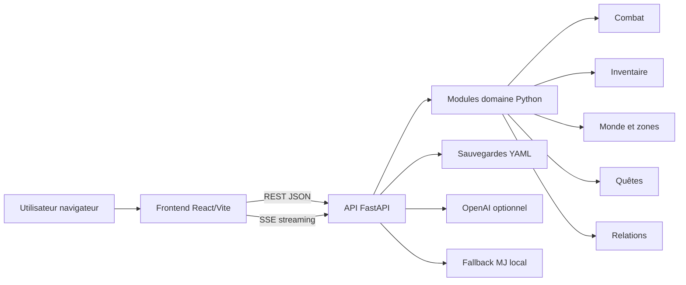

# Bloc 1 — Cadrer un projet de développement d’applications logicielles

## 1. Présentation du projet

**Nom :** Survivant de Ruche

**Type :** application web full-stack de jeu narratif RPG.

**Objectif :** permettre à un utilisateur de jouer une campagne solo dans un univers grimdark, via une interface web React connectée à une API FastAPI. Le jeu gère un personnage, un monde persistant, des quêtes, de l’inventaire, du combat, des déplacements et une narration en streaming.

## 2. Parties prenantes

| Acteur | Rôle | Niveau d’implication | Attentes |
|---|---|---:|---|
| Commanditaire / candidat | Porteur du projet | Fort | Application fonctionnelle, démontrable, valorisable au jury |
| Utilisateur final | Joueur | Fort | Interface claire, expérience immersive, sauvegarde fiable |
| Jury | Évaluateur | Fort | Projet structuré, documentation, preuve de maîtrise technique |
| Développeur frontend | Conception UI React | Moyen | Composants maintenables et ergonomiques |
| Développeur backend | API et logique serveur | Fort | Endpoints fiables, persistance, sécurité |
| Mainteneur | Suivi post-déploiement | Moyen | Procédure de version, anomalies, supervision |
| Fournisseur IA | Service externe OpenAI optionnel | Faible à moyen | Disponibilité API, confidentialité clé |
| Hébergeur | Infrastructure future | Moyen | Déploiement stable, logs, supervision |

## 3. Analyse du besoin

### Besoin principal

Créer une application interactive permettant de jouer une campagne narrative depuis un navigateur, sans dépendre d’un terminal.

### Besoins fonctionnels

- Démarrer une campagne.
- Afficher l’état du personnage.
- Afficher la zone actuelle et les déplacements possibles.
- Gérer les quêtes actives.
- Gérer inventaire, butin et équipement.
- Lancer des dés.
- Démarrer et résoudre un combat.
- Sauvegarder et reprendre l’état du monde.
- Générer une narration MJ en streaming.
- Fonctionner même sans clé OpenAI via un mode MJ local.

### Besoins non fonctionnels

- Application utilisable sur navigateur moderne.
- Architecture maintenable et modulaire.
- Données sauvegardées localement.
- Temps de réponse raisonnable.
- Séparation claire frontend/backend.
- Configuration simple pour un environnement de démonstration.

## 4. SWOT

| Forces | Faiblesses |
|---|---|
| Projet original et démontrable | Tests frontend encore absents |
| Full-stack réel React + FastAPI | Pas encore de déploiement cloud |
| Logique métier riche | Documentation initialement limitée |
| Persistance et monde évolutif | Accessibilité non auditée complètement |
| Mode local sans dépendance IA | Supervision production non branchée |

| Opportunités | Menaces |
|---|---|
| Ajouter CI/CD et hébergement | Changement API OpenAI |
| Démonstration immersive devant jury | Erreurs de port local ou environnement |
| Extension mobile ou PWA | Fuite de clé API si mauvaise configuration |
| Ajout tests end-to-end | Dette technique si fonctionnalités ajoutées sans tests |

## 5. Faisabilité technique

| Élément | Choix retenu | Justification |
|---|---|---|
| Backend | Python FastAPI | Rapide, typé, adapté API REST/SSE |
| Frontend | React + Vite | Expérience moderne, composants, build rapide |
| Persistance | YAML local | Simple, lisible, adapté prototype |
| Narration | OpenAI + fallback local | Expérience IA, mais mode dégradé robuste |
| Tests | Pytest | Standard Python simple à lancer |
| Lancement | Scripts `.bat` | Adapté environnement Windows local |

## 6. Risques projet

| Risque | Probabilité | Impact | Criticité | Mitigation |
|---|---:|---:|---:|---|
| Clé OpenAI absente | Moyenne | Moyen | Moyenne | Mode MJ local déjà implémenté |
| Port backend/frontend occupé | Haute | Moyen | Moyenne | Script `start_game.bat` nettoie les ports |
| Régression API | Moyenne | Fort | Forte | Ajouter tests endpoints API |
| Sauvegarde corrompue | Faible | Fort | Moyenne | Prévoir sauvegardes horodatées |
| UI non accessible | Moyenne | Moyen | Moyenne | Audit RGAA et amélioration contraste/clavier |
| Couverture test faible | Moyenne | Fort | Forte | Ajouter tests backend + frontend |
| Dépendance externe instable | Moyenne | Moyen | Moyenne | Abstraction du fournisseur IA |

## 7. Architecture cible

## 8. Estimation de charge

| Lot | Charge estimée |
|---|---:|
| Cadrage et analyse | 2 j |
| Modélisation logique métier | 5 j |
| Backend API | 4 j |
| Frontend React | 5 j |
| Persistance et sauvegarde | 2 j |
| Tests | 2 j |
| Documentation RNCP | 3 j |
| Stabilisation et démonstration | 2 j |
| **Total** | **25 jours-homme** |

## 9. Estimation budgétaire indicative

Hypothèse : 450 € / jour-homme.

| Poste | Coût estimé |
|---|---:|
| Développement | 18 j × 450 € = 8 100 € |
| Tests / recette | 2 j × 450 € = 900 € |
| Documentation | 3 j × 450 € = 1 350 € |
| Stabilisation | 2 j × 450 € = 900 € |
| Infrastructure prototype | 0 à 30 €/mois |
| API IA selon usage | variable |
| **Total projet indicatif** | **11 250 € hors coût API** |

## 10. Préconisation

Le projet est techniquement pertinent pour une démonstration RNCP, à condition de le présenter comme une application web interactive full-stack et non comme un simple jeu. La solution retenue est adaptée au prototype : rapide à développer, modulaire, démontrable localement et extensible vers un déploiement cloud ultérieur.
