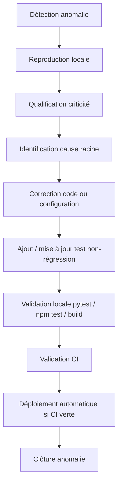

# Plan de correction des bogues — C2.3.2

**Certification :** Expert en Développement Logiciel — RNCP 39583  
**Bloc :** Bloc 2 — Concevoir et développer des applications logicielles  
**Projet :** RPG 40K Survivor (« Survivant de Ruche »)  
**Objectif du livrable :** démontrer que les anomalies sont détectées, qualifiées,
traitées, vérifiées par tests et tracées.

---

## 1. Attendu officiel de la grille

**Compétence C2.3.2.** Élaborer un plan de correction des bogues à partir de
l’analyse des anomalies et des régressions détectées au cours de la recette afin de
garantir le fonctionnement du logiciel conformément à l’attendu.

**Livrable attendu :** le plan de correction des bogues.

**Critères d’évaluation :**
- les bogues de code sont détectés, qualifiés et traités ;
- une analyse des points d’amélioration est réalisée pour chaque test en échec ;
- les corrections et améliorations proposées sont conformes à l’attendu et
  garantissent le bon fonctionnement du logiciel.

---

## 2. Workflow de traitement d’une anomalie



## 3. Niveaux de criticité

| Niveau | Définition | Exemple projet | Délai cible |
|---|---|---|---|
| Critique | Application inutilisable ou déploiement impossible | CI/CD ne peut pas se connecter au VPS | Immédiat |
| Majeur | Fonction essentielle cassée ou sécurité affaiblie | Route protégée accessible sans JWT | < 24 h |
| Mineur | Défaut non bloquant ou confusion utilisateur | Message d’erreur IA imprécis | Sprint courant |
| Amélioration | Dette technique, robustesse, lisibilité | Ajout de tests unitaires métier | Backlog priorisé |

## 4. Registre des anomalies traitées

| ID | Anomalie / régression | Détection | Criticité | Cause racine | Correction appliquée | Test / preuve de non-régression | Statut |
|---|---|---|---|---|---|---|---|
| BUG-001 | Ancienne identification `X-User-Id` falsifiable | Audit sécurité activité 5 | Majeur | Identité déclarative envoyée par le client | Remplacement par JWT signé + dépendance `get_current_user` | `tests/test_api.py`, routes sans token → `401` | ✅ Corrigé |
| BUG-002 | Mots de passe non suffisamment protégés côté persistance | Audit sécurité | Majeur | Absence initiale de hachage applicatif robuste | Ajout bcrypt et stockage `password_hash` | Test vérifiant que le hash ne contient pas le mot de passe | ✅ Corrigé |
| BUG-003 | Message de fallback IA trompeur en cas de `billing_not_active` | Test manuel OpenAI | Mineur | Même message pour clé absente et service OpenAI indisponible | Distinction clé absente / erreur fournisseur + repli MJ local | Démo possible sans crash, message explicite | ✅ Corrigé |
| BUG-004 | Déploiement GitHub Actions refusé par SSH | Run GitHub Actions échoué | Critique | Clé privée multi-lignes mal transmise + clé publique non autorisée VPS | Secret `VPS_SSH_KEY_B64`, décodage base64, `IdentitiesOnly`, ajout `authorized_keys` | Run `Deploy VPS` réussi + `/api/health` OK | ✅ Corrigé |
| BUG-005 | Job GitLab prévu manuel alors que le besoin était CD auto | Relecture pipeline | Mineur | `when: manual` dans `.gitlab-ci.yml` | Passage `when: on_success` sur `main` | Validation YAML + documentation à jour | ✅ Corrigé |
| BUG-006 | Armure équipée désérialisée en `Item` générique | Nouveau test unitaire inventaire | Majeur | `item_from_dict()` ne reconstruisait pas une `Armor` inconnue des templates | Reconstruction générique `Armor(...)` si `type == armure` | `test_inventory_round_trip_serialization_preserves_equipment` | ✅ Corrigé |
| BUG-007 | Risque de régression sur inventaire, progression, carte, quêtes | Analyse couverture fonctionnelle | Amélioration | Modules métier peu couverts par tests unitaires | Ajout de tests dédiés `test_inventory.py`, `test_progression.py`, `test_world.py`, `test_quests.py` | `pytest -q` → `39 passed` | ✅ Corrigé |
| BUG-008 | App initialement non accessible sur l’ancien VPS | Test accès réseau | Critique | Ancienne cible VPS indisponible / port non exposé | Redéploiement Docker Compose sur `89.116.111.166:8081` | `GET /api/health` → `200 OK` | ✅ Corrigé |

---

## 5. Analyse des tests en échec et améliorations associées

| Test / validation en échec | Cause analysée | Amélioration apportée |
|---|---|---|
| GitHub Actions `Deploy VPS` → `Permission denied (publickey,password)` | La clé de déploiement n’était pas autorisée seule sur le VPS ; la machine locale passait via une autre clé SSH | Test `ssh -F /dev/null -o IdentitiesOnly=yes`, ajout de la clé publique dédiée au VPS, secret base64 |
| `test_inventory_round_trip_serialization_preserves_equipment` | Une armure custom était restaurée en `Item`, donc sans `defense_bonus` | Correction de `item_from_dict()` pour reconstruire une `Armor` générique |
| Test progression XP initial | Attendu de test incorrect vis-à-vis de la formule réelle de niveau | Ajustement du test à l’overflow réel (`25 XP`) sans modifier la logique métier |

---

## 6. Stratégie de non-régression

| Domaine | Tests / preuve | Objectif |
|---|---|---|
| Authentification | `tests/test_api.py` | Vérifier JWT, bcrypt, 401/403 |
| Inventaire | `tests/test_inventory.py` | Empêcher régressions poids, stack, équipement, sérialisation |
| Progression | `tests/test_progression.py` | Vérifier XP, niveaux, compétences, prérequis |
| Carte / déplacement | `tests/test_world.py` | Vérifier zones, blocages, découverte, sérialisation |
| Quêtes | `tests/test_quests.py` | Vérifier objectifs, timers, récompenses, journal |
| Frontend | `frontend/src/**/__tests__` | Vérifier composants et appels API |
| E2E | `frontend/e2e/game.spec.js` | Vérifier parcours utilisateur navigateur |
| CI/CD | GitHub Actions | Empêcher déploiement si tests/build/E2E échouent |

Résultat de validation backend actuel :

```powershell
pytest -q
# 39 passed
```

---

## 7. Procédure standard de correction future

1. Créer une entrée `BUG-XXX` dans ce registre.
2. Reproduire l’anomalie localement ou via CI.
3. Identifier le composant : backend, frontend, CI/CD, VPS, documentation.
4. Corriger le code ou la configuration.
5. Ajouter un test non-régression si l’anomalie est reproductible.
6. Exécuter les validations :
   - backend : `pytest -q` ;
   - frontend : `npm test` ;
   - build : `npm run build` ;
   - E2E : `npm run e2e` si parcours concerné.
7. Pousser sur `main` uniquement si validation locale OK.
8. Laisser la CI vérifier et déployer automatiquement si elle est verte.
9. Clôturer l’anomalie dans le registre avec preuve (test, commit, run CI).

---

## 8. Conclusion C2.3.2

Le projet dispose désormais d’un **plan de correction des bogues dédié**, d’un
registre d’anomalies qualifiées, de corrections déjà traitées et de tests de
non-régression associés. Le critère C2.3.2 est donc couvert par :
- ce document ;
- les tests unitaires et E2E ;
- l’historique Git ;
- la CI/CD qui bloque le déploiement si une régression est détectée.
