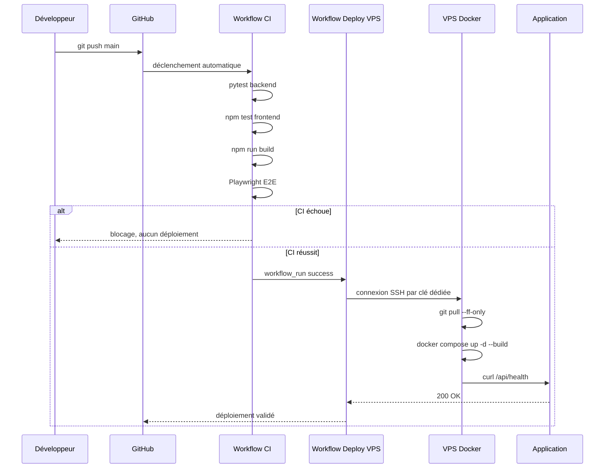

# Protocole de déploiement continu et critères qualité/performance — C2.1.1

**Certification :** Expert en Développement Logiciel — RNCP 39583  
**Bloc :** Bloc 2 — Concevoir et développer des applications logicielles  
**Critère :** C2.1.1 — Environnements de déploiement et de test + suivi qualité/performance  
**Projet :** RPG 40K Survivor (« Survivant de Ruche »)

---

## 1. Attendu officiel de la grille

**Compétence C2.1.1.** Mettre en œuvre des environnements de déploiement et de test
en y intégrant les outils de suivi de performance et de qualité afin de permettre le
bon déroulement de la phase de développement du logiciel.

**Livrables attendus :**
- le protocole de déploiement continu ;
- les critères de qualité et de performance.

**Critères d’évaluation :**
- le protocole de déploiement continu est explicité ;
- l’environnement de développement est détaillé ;
- les outils mobilisés identifient les composants : compilateur, serveur
  d’application, outils de gestion de sources ;
- le protocole définit les différentes séquences de déploiement ;
- les critères qualité/performance répondent aux exigences du projet.

---

## 2. Environnements mis en œuvre

| Environnement | Rôle | Technologie / outil | URL / commande |
|---|---|---|---|
| Développement local | Coder et tester rapidement | VS Code, Python 3.13, Node 22, Vite | `uvicorn backend.api:app --reload`, `npm run dev` |
| Tests backend | Valider API et logique métier | `pytest` | `python -m pytest -q` |
| Tests frontend | Valider composants et client API | Vitest + React Testing Library | `cd frontend; npm test` |
| Build frontend | Vérifier la compilation production | Vite | `cd frontend; npm run build` |
| Tests E2E | Simuler un parcours navigateur | Playwright | `cd frontend; npm run e2e` |
| CI | Automatiser tests/build à chaque push | GitHub Actions | [.github/workflows/ci.yml](../../.github/workflows/ci.yml) |
| CD | Déployer automatiquement après CI verte | GitHub Actions + SSH + Docker Compose | [.github/workflows/deploy-vps.yml](../../.github/workflows/deploy-vps.yml) |
| Production | Application jouable par le jury | VPS + Docker Compose | `http://89.116.111.166:8081/` |
| Supervision minimale | Contrôler disponibilité | Healthcheck FastAPI | `http://89.116.111.166:8081/api/health` |

---

## 3. Outils et composants techniques mobilisés

| Famille | Outil | Usage dans le projet |
|---|---|---|
| Éditeur | VS Code | Développement, terminal, Git, tests |
| Gestion source | Git + GitHub | Historique, commits, déclenchement CI/CD |
| Runtime backend | Python 3.13 | Exécution FastAPI et logique métier |
| Serveur applicatif | Uvicorn / FastAPI | API REST + SSE + healthcheck |
| Runtime frontend | Node.js 22 | Tests, build, outillage frontend |
| Build frontend | Vite | Compilation de la SPA React |
| Tests backend | pytest | Tests API, sécurité, domaine métier |
| Tests frontend | Vitest / RTL | Tests composants et client API |
| Tests E2E | Playwright | Parcours navigateur complet |
| Conteneurisation | Docker Compose | Build et exécution production |
| Déploiement | GitHub Actions + SSH | Pull code, rebuild, restart, healthcheck |
| Qualité / perf | Healthcheck, tests, build size | Critères mesurables avant/après déploiement |

---

## 4. Protocole de déploiement continu

Le déploiement continu est basé sur le principe : **un push sur `main` ne part en
production que si la CI est verte**.



### Séquences détaillées

| Étape | Déclencheur | Action | Condition de succès | Blocage si échec |
|---|---|---|---|---|
| 1 | Push sur `main` | Démarrage workflow `CI` | Run créé | Oui |
| 2 | Job backend | Installation Python + `pytest` | Tous les tests backend passent (`39 passed`) | Oui |
| 3 | Job frontend unit | `npm ci` + `npm test` | Tests frontend passent (`13 passed`) | Oui |
| 4 | Job frontend build | `npm run build` | Bundle généré sans erreur | Oui |
| 5 | Job E2E | Backend + frontend locaux + Playwright | Parcours navigateur OK | Oui |
| 6 | CI verte | Déclenchement `Deploy VPS` via `workflow_run` | Conclusion CI = `success` | Oui |
| 7 | SSH VPS | Décodage clé `VPS_SSH_KEY_B64` + connexion SSH | Authentification clé OK | Oui |
| 8 | Mise à jour code | `git fetch`, `checkout main`, `pull --ff-only` | Code serveur à jour | Oui |
| 9 | Build/restart prod | `docker compose -p rpg40k up -d --build` | Conteneurs démarrés | Oui |
| 10 | Validation prod | `curl http://127.0.0.1:8081/api/health` | HTTP 200 + JSON `status: ok` | Oui |

---

## 5. Variables et secrets de déploiement

Les secrets sont configurés dans **GitHub → Settings → Secrets and variables → Actions**.

| Secret / variable | Rôle | Exemple / valeur |
|---|---|---|
| `VPS_HOST` | Adresse du serveur | `89.116.111.166` |
| `VPS_USER` | Utilisateur SSH | `root` |
| `VPS_PORT` | Port SSH | `22` |
| `VPS_SSH_KEY_B64` | Clé privée dédiée encodée base64 | Secret GitHub |
| `APP_DIR` | Dossier applicatif sur le VPS | `/opt/rpg-40k` |
| `RPG40K_BIND_ADDRESS` | Bind public Docker | `0.0.0.0` |
| `RPG40K_HTTP_PORT` | Port applicatif public | `8081` |

La clé SSH dédiée est ajoutée dans `/root/.ssh/authorized_keys` sur le VPS. Elle est
encodée en base64 pour éviter les corruptions liées aux secrets multi-lignes.

---

## 6. Critères qualité

| Critère qualité | Seuil attendu | Preuve / commande |
|---|---:|---|
| Tests backend | 100 % des tests passent | `pytest -q` → `39 passed` |
| Tests frontend | 100 % des tests passent | `npm test` → `13 passed` |
| Build frontend | Aucun échec de compilation | `npm run build` OK |
| E2E | Parcours principal OK | `npm run e2e` / job GitHub Actions |
| Sécurité auth | Route protégée sans JWT refusée | Test API `401` |
| Déploiement | Un push cassé ne déploie pas | `Deploy VPS` conditionné par CI verte |
| Healthcheck prod | API répond `status: ok` | `/api/health` HTTP 200 |
| Traçabilité | Chaque évolution est versionnée | Historique Git / commits |
| Secrets | Aucun secret dans le dépôt | `.env` ignoré + GitHub Secrets |
| Maintenabilité | Modules métier testés | Tests inventaire, progression, carte, quêtes |

---

## 7. Critères performance

| Critère performance | Seuil cible | État actuel / justification |
|---|---:|---|
| Healthcheck API | < 2 s | Vérifié via `Invoke-RestMethod` / `curl` |
| Démarrage conteneur | Conteneur sain après build | `docker compose ps` + healthcheck |
| Taille bundle JS | < 300 kB non gzip | Build actuel ≈ 210.86 kB |
| Taille bundle JS gzip | < 100 kB gzip | Build actuel ≈ 65.86 kB gzip |
| Taille CSS gzip | < 5 kB gzip | Build actuel ≈ 2.67 kB gzip |
| Robustesse IA | Aucun blocage si OpenAI indisponible | Repli MJ local |
| Performance perçue IA | Premiers tokens visibles rapidement | Streaming SSE |
| Disponibilité démo | Application joignable publiquement | `http://89.116.111.166:8081/` |

Les seuils sont adaptés au périmètre : application web solo textuelle, usage
pédagogique/jury, faible volumétrie, backend FastAPI léger et frontend React/Vite.

---

## 8. Suivi qualité/performance en production

| Élément suivi | Méthode | Action si échec |
|---|---|---|
| API disponible | `/api/health` | Consulter logs Docker, rollback si nécessaire |
| Conteneurs actifs | `docker compose -p rpg40k ps` | Redémarrer service ou reconstruire image |
| Logs runtime | `docker compose -p rpg40k logs -f` | Identifier exception ou erreur OpenAI |
| CI/CD | GitHub Actions | Corriger test/build avant redeploy |
| Frontend servi | Accès navigateur à `/` | Vérifier build Vite et proxy `/api` |

---

## 9. Rollback / retour arrière

En cas d’échec en production malgré la CI :

1. identifier le dernier commit stable dans GitHub ;
2. se connecter au VPS ;
3. revenir au commit stable ;
4. reconstruire les conteneurs ;
5. vérifier `/api/health`.

```bash
cd /opt/rpg-40k
git log --oneline -5
git checkout <commit-stable>
docker compose -p rpg40k up -d --build
curl -fsS http://127.0.0.1:8081/api/health
```

Le déclenchement manuel du workflow **Deploy VPS** reste disponible pour redéployer une
branche ou une version stabilisée.

---

## 10. Conclusion C2.1.1

Le projet dispose d’un protocole CI/CD complet :
- environnements local, test, CI et production identifiés ;
- outils de compilation, test, serveur applicatif et gestion source documentés ;
- séquences de déploiement continu explicitées ;
- critères qualité/performance mesurables ;
- déploiement automatique sur VPS uniquement après CI verte.

Le livrable C2.1.1 est donc couvert par ce document, les workflows GitHub Actions,
le déploiement Docker Compose sur VPS et les preuves de tests/build/healthcheck.
